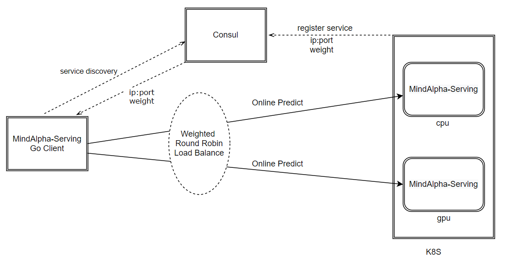

# mindalpha-serving-go-client, go语言实现的MindAlpha-Serving客户端
[English Document](README.md)<br>
MindAlpha-Serving是一个在线预测服务, 该客户端为客户提供了访问MindAlpha-Serving在线预测服务的能力.<br>
用户如果想用我们的在线预测服务 ***MindAlpha-Serving*** 的话，请参考 https://github.com/mindalpha/serving-helm-chart <br>
用户如果想用我们的离线训练服务 ***MindAlpha*** 的话，请参考 https://github.com/mindalpha/MindAlpha <br>

## 与服务端交互流程
下图描述本客户端与服务端MindAlpha-Serving的交互流程<br>


如上图所示:
1. MindAlpha-Serving 服务端启动后, 将自身的IP:Port以及权重信息注册到consul上
2. mindalpha-serving-go-client 从consul上读取MindAlpha-Serving服务端的IP:Port 以及权重信息
3. mindalpha-serving-go-client 构造IndexBatch, 然后使用加权负载均衡算法访问MindAlpha-Serving服务端, 服务端返回在线预测结果

## 功能与特性
1. 构造IndexBatch(通过AddColumn(单值特征), AddColumnArray(多值特征))
2. 使用flatbuffer 协议做 Request 的序列化, Response的反序列化. 具体flatbuffer协议定义参考 [proto](proto/)
3. 基于consul的服务发现. MindAlpha-Serving服务启动后会将自身信息注册到consul service上, 该客户端能够监测到MindAlpha-Serving 服务实例的增减
4. 连接池功能. 从consul上读取MindAlpha-Serving服务地址列表, 为每个MindAlpha-Serving地址预建立多条连接(连接数目可配置), 并监听consul上MindAlpha-Serving服务地址列表的变化建立或关闭连接
5. 加权轮询负载均衡
6. 将IndexBbatch序列化为string, 通过GetRowFeatures()接口实现
7. 从文件加载数据构造IndexBatch, 通过LoadFromCsvFile()接口实现
8. 在线预测接口Predict(), 返回score slice
9. 调试功能: 打印IndexBatch(DebugString()接口); 反序列化Request(ParseMindAlphaServingRequest()接口)


## 本客户端的完整用法
使用该客户端的步骤如下: <br>
1. 实现日志接口，并设置客户端使用之
2. 配置consul及连接池参数, 用来做服务发现和负载均衡
3. 用连接池参数初始化连接池
4. 构造IndexBatch
5. 在线预测
6. 处理服务端返回的scores
7. 将IndexBatch放回内存池

以下示例代码展示了使用本客端的基本步骤: 

```go
import (
	"github.com/cihub/seelog"
	"github.com/mindalpha/mindalpha-serving-go-client/fe"
	client_logger "github.com/mindalpha/mindalpha-serving-go-client/logger"
	"github.com/mindalpha/mindalpha-serving-go-client/pool"
	"testing"
)

//implement LOG interface.
type MyLogger struct {
}

func (myLogger *MyLogger) Debugf(format string, v ...interface{}) {
	seelog.Debugf(format, v...)
}
// set log use MyLogger.
client_logger.SetMindAlphaServingClientLogger(&MyLogger{})

// connection pool configuration.
conf := pool.MindAlphaServingClientPoolConfig{
	ConsulAddr: "127.0.0.1:8500", //consul address
	MindAlphaServingService: "cluster.mindalpha-serving.remote.service", // MindAlpha-Serving service name on consul
	MaxConnNumPerAddr: 10,
}
// initialize connection pool
pool.InitMindAlphaServingClientPool(&conf)

// generate IndexBatch object.
ib := fe.NewIndexedColumn(3, 200)

// construct IndexBatch, add columns/features to IndexBatch
// The data used to construct IndexBatch comes from data/day_0_0.001_train-ib-format.csv and data/column_name_criteo.txt. 
// This demo code used the first row of file data/day_0_0.001_train-ib-format.csv as column value, and use the content of data/column_name_criteo.txt as column name.
// To learn more about the data we used to construct IndexBatch, please refer to data/
ib.AddColumn("integer_feature_1", "", 2, 0)
ib.AddColumn("integer_feature_2", "478", 2, 0)
ib.AddColumn("integer_feature_3", "1", 2, 0)
ib.AddColumn("integer_feature_4", "2", 2, 0)
ib.AddColumn("integer_feature_5", "9", 2, 0)
ib.AddColumn("integer_feature_6", "6", 2, 0)
ib.AddColumn("integer_feature_7", "0", 2, 0)
ib.AddColumn("integer_feature_8", "36", 2, 0)
ib.AddColumn("integer_feature_9", "3", 2, 0)
ib.AddColumn("integer_feature_10", "1", 2, 0)
ib.AddColumn("integer_feature_11", "5", 2, 0)
ib.AddColumn("integer_feature_12", "721", 2, 0)
ib.AddColumn("integer_feature_13", "1", 2, 0)

ib.AddColumn("categorical_feature_1", "265366bf", 2, 0)
ib.AddColumn("categorical_feature_2", "b1feb7c7", 2, 0)
ib.AddColumn("categorical_feature_3", "fddc0f59", 2, 0)
ib.AddColumn("categorical_feature_4", "67ecc871", 2, 0)
ib.AddColumn("categorical_feature_5", "4dc31926", 2, 0)
ib.AddColumn("categorical_feature_6", "6fcd6dcb", 2, 0)
ib.AddColumn("categorical_feature_7", "ee3c4dac", 2, 0)
ib.AddColumn("categorical_feature_8", "ab96c6b2", 2, 0)
ib.AddColumn("categorical_feature_9", "25dd8f9a", 2, 0)
ib.AddColumn("categorical_feature_10", "e63d98b4", 2, 0)
ib.AddColumn("categorical_feature_11", "c939136f", 2, 0)
ib.AddColumn("categorical_feature_12", "8490a3ea", 2, 0)
ib.AddColumn("categorical_feature_13", "a77a4a56", 2, 0)
ib.AddColumn("categorical_feature_14", "", 2, 0)
ib.AddColumn("categorical_feature_15", "5cbc7f6a", 2, 0)
ib.AddColumn("categorical_feature_16", "", 2, 0)
ib.AddColumn("categorical_feature_17", "", 2, 0)
ib.AddColumn("categorical_feature_18", "a1eb1511", 2, 0)
ib.AddColumn("categorical_feature_19", "108a0699", 2, 0)
ib.AddColumn("categorical_feature_20", "47849e55", 2, 0)
ib.AddColumn("categorical_feature_21", "73b3f46d", 2, 0)
ib.AddColumn("categorical_feature_22", "d994ba60", 2, 0)
ib.AddColumn("categorical_feature_23", "", 2, 0)
ib.AddColumn("categorical_feature_24", "4dc8c296", 2, 0)
ib.AddColumn("categorical_feature_25", "321935cd", 2, 0)
ib.AddColumn("categorical_feature_26", "2ba8d787", 2, 0)


// generate Predictor
predictor, _ := NewPredictor()

// online predict. "demo_model" is exported model name,
// third param is timeout in milliseconds
predictor.Predict(ib, "demo_model", 100)

// do something with  MindAlpha-Serving returned scores
score_num := predictor.GetScoreSize()

// do something with scores
// the first score related to the first row of ib
// the second score related to the second row of ib, etc.
for i := 0; i < score_num; i++ {
	score := predictor.GetScore(i)
	client_logger.GetMindAlphaServingClientLogger().Debugf("score[%v] = %v", i, score)
}

// put IndexBatch to sync.Pool when you do not need ib.
ib.Free()

```
**完整的示例代码请参考: [示例代码](predict/predictor_test.go), 示例代码中构造IndexBatch所使用的的数据请参考 [data/](data/)**

## data
本客户端用到的数据.<br>
上面的示例代码中构造IndexBatch所使用的数据来自[data/](data/)目录.<br>
想了解更多的数据信息，请参考[data/](data/)

## 各个子模块介绍
### 日志接口的使用
日志接口的定义及说明文档在[logger/](logger/) 路径下

### 连接池的实现与使用
连接池详情参考[pool](pool/), 其使用方法也可结合[Predic()方法](predict/predictor.go)以及[predict/](predict)下的测试用例来了解. <br>
**用户使用该客户端时，只需要设置连接池的配置参数和初始化连接池就可以了.**

### IndexBatch说明与使用
IndexBatch实现及说明请参考[fe/](fe/)

### 在线预测客户端接口的实现与使用
具体的代码请参考[示例代码](predict/predictor_test.go)

### flatbuffer协议定义
协议定义: [proto/](proto/) <br>
协议生成的代码: [gen/](gen/) <br>
**用户不要修改该协议，否则会与MindAlpha-Serving服务端不兼容.**

